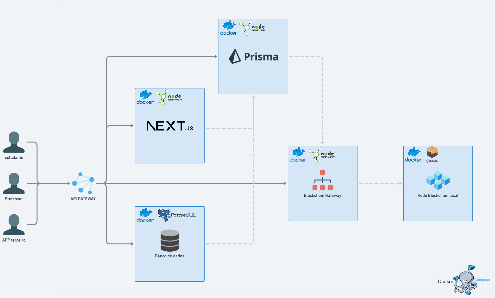

# **Repositório do projeto final das disciplinas DCC603 - Banco de dados II e DCC602 - Sistemas distribuídos.**

## **SGCursos - Sistema de Gerenciamento de Cursos do departamento de Ciência da Computação da UFRR.**

## **Ministrado por:** **DCC603** - [Acauan Ribeiro](https://github.com/acauanrr) ------- **DCC602** - Leandro Balico

## **Integrantes do grupo:**

- Guilherme Lucas Pereira Bernardo
- Hugo Lima Romão
- Kelvin Araújo Ferreira

## **microsserviços e suas funcionalidades**

- **ufrr-postgres**
  - microsserviço destinado a manter o banco de dados da aplicação, com uso da imagem oficial do docker para postgres:latest
- **ufrr-prisma-api**
  - microsserviço destinado a manter o backend da aplicação, com uso da imagem criada a partir dos dados deste repositório, com tecnologias usadas descritas na sessão logo abaixo.⬇️⬇️⬇️⬇️
- **ufrr-ganache**
  - microsserviço destinado a manter o servidor de autenticação da aplicação, mantendo contato entre o backend e o microsserviço de blockchain
- **ufrr-ethereum**
  - microsserviço destinado a manter o servidor da rede blockchain local, realização a validação dos requests de certificado enviados pelo ganache e o prisma-api.
- **ufrr-nextjs**
  - microsserviço destinado a manter o frontend da aplicação. De forma responsiva, também é capaz de fornecer uma versão mobile para a aplicação.

## **Tecnologias usadas:**

- **frontend**:
  - JavaScript
  - TypeScript
  - Html
  - CSS
  - React.js
  - Next.js
  - Styled Components
  - Storybook
  - Husky
  - Material UI
  - Jest
- **backend**:
  - TypeScript
  - Node.js
  - Jest
  - Prisma
  - PostgreSQL
- **infraestrutura e gerenciamento de projeto**:
  - Docker
  - Git hooks
  - Mockoon
  - Git
  - Github
- **blockchain**:
  - Web3
  - Truffle
  - Ganache
  - Solidity

# **Relatório de desenvolvimento da aplicação:**

## [click here](https://docs.google.com/document/d/1ZvDegi_lzMK8G3Dbyq6W4ewG2hoDCrOe/edit?usp=sharing&ouid=100008897815631174283&rtpof=true&sd=true)

## **instruções para implementação da aplicação em ambiente local:**

- Ter Docker instalado na máquina.
- Estar no diretório raiz do projeto pelo terminal.
- digitar o comando:
      docker-compose up -d
- verificar se está funcionando com o comando: 
      docker ps
- abrir o navegador de sua preferência.
- digitar por localhost:3000 para abrir o frontend e poder utilizar a aplicação.
